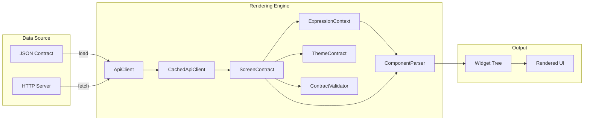
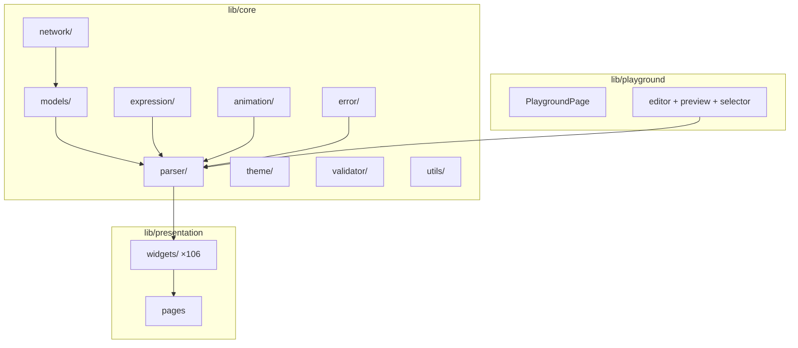

<div align="center">

# Server-Driven UI in Flutter


**Build dynamic screens from JSON contracts — zero hardcoded layouts.**


[](https://github.com/Ryanditko/flutter-backend-driven-ui/actions/workflows/ci.yml)
[](https://codecov.io/gh/Ryanditko/flutter-backend-driven-ui)

[Architecture Docs](docs/ARCHITECTURE.md) · [Mock Server](server/README.md)

</div>

---

## Overview

A production-style **server-driven UI** architecture built entirely with Flutter and Dart. Every layout, component, and navigation action is defined by JSON contracts that the engine renders dynamically at runtime.

In a server-driven UI (also called Backend-Driven Content), the client is a **generic rendering engine**. Instead of writing widgets for each screen, you define screens as data — a JSON tree describing which components to render, how to lay them out, and what actions they trigger.

---

## Data Flow



---

## Architecture



---

## Features

### Components (106 types)

| Category | Components |
|----------|-----------|
| **Core Layout** | `column` · `row` · `container` · `card` · `listView` · `stack` · `positioned` · `wrap` · `spacer` · `responsive` · `expanded` · `flexible` |
| **Layout Wrappers** | `center` · `align` · `padding` · `sizedBox` · `constrainedBox` · `fittedBox` · `fractionallySizedBox` · `intrinsicHeight` · `intrinsicWidth` · `limitedBox` · `overflowBox` · `aspectRatio` · `baseline` · `opacity` · `clipRRect` · `clipOval` · `safeArea` · `rotatedBox` · `ignorePointer` · `absorbPointer` · `offstage` · `visibility` |
| **Decorators** | `material` · `hero` · `decoratedBox` · `indexedStack` · `transform` · `backdropFilter` · `banner` |
| **Scrollables** | `scrollView` · `gridView` · `pageView` · `customScrollView` · `sliverList` · `sliverGrid` |
| **Interactives** | `inkWell` · `gestureDetector` · `tooltip` · `dismissible` · `draggable` · `longPressDraggable` |
| **Animated** | `animatedContainer` · `animatedOpacity` · `animatedCrossFade` · `animatedSwitcher` · `animatedAlign` · `animatedPadding` · `animatedPositioned` · `animatedSize` · `animatedScale` |
| **Tiles** | `listTile` · `expansionTile` · `switchListTile` · `checkboxListTile` · `radioListTile` |
| **Tables** | `table` · `tableRow` · `tableCell` · `dataTable` |
| **Text Variants** | `selectableText` · `richText` · `defaultTextStyle` |
| **Button Variants** | `textButton` · `outlinedButton` · `iconButton` · `floatingActionButton` · `segmentedButton` |
| **Media & Display** | `placeholder` · `circleAvatar` · `verticalDivider` · `popupMenuButton` · `searchBar` · `searchAnchor` · `tooltip` |
| **Leaf** | `text` · `button` · `image` · `input` · `divider` · `icon` · `chip` · `progress` · `badge` |
| **Interactive Inputs** | `switch` · `checkbox` · `dropdown` · `tabBar` · `carousel` · `slider` · `rangeSlider` · `radio` |

### Actions (7 types)

`navigate` · `snackbar` · `submit` · `goBack` · `openUrl` · `copyToClipboard` · `showDialog`

### Engine Capabilities

- **Expression Engine** — `{{variable}}` template interpolation and conditional visibility
- **Dynamic Theming** — per-screen color, typography, and brightness from JSON
- **Contract Validation** — schema checks before rendering with detailed warnings
- **Remote API + Caching** — `HttpApiClient` for HTTP fetching, `CachedApiClient` with TTL
- **Playground** — live JSON editor with syntax highlighting, split-view preview, and screen selector
- **Form Validation** — declarative `required`, `minLength`, `maxLength`, `pattern` rules from JSON
- **Entrance Animations** — `fadeIn`, `slideUp`, `slideLeft`, `scale` per-component via `props.animation`
- **Error Boundary** — graceful error handling per component, prevents cascading failures
- **Accessibility** — `Semantics` labels on interactive components (buttons, chips, inputs, switches, checkboxes), text variants, media (images, icons, avatars, badges, progress indicators, dividers), and interactive wrappers (inkWell, gestureDetector)
- **Responsive Layout** — breakpoint system (compact / medium / expanded) with `responsive`, `expanded`, `flexible`
- **Page Transitions** — animated navigation with fade, slide-up, and horizontal slide routes
- **Mock Backend** — standalone Dart Shelf server serving contracts via REST API

---

## Demo Screens

| Screen | Description |
|--------|-------------|
| `home` | Welcome page with navigation to all demos and a banner image |
| `profile` | User profile with avatar, details card, and snackbar action |
| `form` | Feedback form with validation, entrance animations, and submit |
| `components_showcase` | Every core component type in one screen |
| `expressions_demo` | Template interpolation and conditional visibility |
| `theme_demo` | Dark theme applied via JSON contract |
| `new_components` | Dropdown, tab bar, and carousel showcase |
| `advanced_components` | Layout wrappers, decorators, tiles, buttons, text variants, and misc widgets |

---

## Quick Start

```bash
flutter pub get
flutter run
```

The landing page offers two modes:

- **App Demo** — navigate through pre-built screens loaded from `assets/screens/`
- **Playground** — edit JSON contracts and preview rendered output in real-time

### Running the Mock Server

```bash
cd server
dart pub get
dart run bin/server.dart
```

The server starts on `http://localhost:8080` and serves contracts from `assets/screens/`.

---

## JSON Contract Example

```json
{
  "schemaVersion": "1.0",
  "context": {
    "user": { "name": "Ryanditko" }
  },
  "theme": {
    "primaryColor": "#820AD1",
    "brightness": "dark"
  },
  "screen": {
    "id": "example",
    "title": "Hello",
    "root": {
      "type": "column",
      "props": { "crossAxisAlignment": "stretch", "padding": 24 },
      "children": [
        {
          "type": "text",
          "props": {
            "content": "Hi, {{user.name}}!",
            "style": { "fontSize": 24 },
            "animation": { "type": "fadeIn", "duration": 500 }
          }
        },
        {
          "type": "input",
          "id": "email",
          "props": {
            "label": "Email",
            "validation": {
              "required": true,
              "pattern": "^[\\w-\\.]+@([\\w-]+\\.)+[\\w-]{2,4}$",
              "message": "Enter a valid email"
            }
          }
        },
        {
          "type": "button",
          "props": { "label": "Go to Profile" },
          "action": { "type": "navigate", "targetScreenId": "profile" }
        }
      ]
    }
  }
}
```

---

## Adding a New Screen

1. Create a JSON file at `assets/screens/your_screen.json`
2. Reference it from any button action:

```json
{ "type": "navigate", "targetScreenId": "your_screen" }
```

No Dart code changes needed.

## Adding a New Component

1. Create a builder function in `lib/presentation/widgets/`
2. Register it in `ComponentParser._registerDefaults()`:

```dart
_registry.register('yourType', buildYourComponent);
```

---

## Documentation

- [Architecture & Schema Specification](docs/ARCHITECTURE.md)
- [Component Reference Catalog](docs/COMPONENTS.md)
- [Mock Server](server/README.md)

---

## Tech Stack

| Concern | Technology |
|---------|-----------|
| Language |  |
| Framework |  |
| Design System |  |
| Data Format |  |
| Backend |  |
| CI/CD |  |
| Architecture | Server-Driven UI / Backend-Driven Content |

---

<div align="center">

Built with Flutter + Material Design 3

</div>
