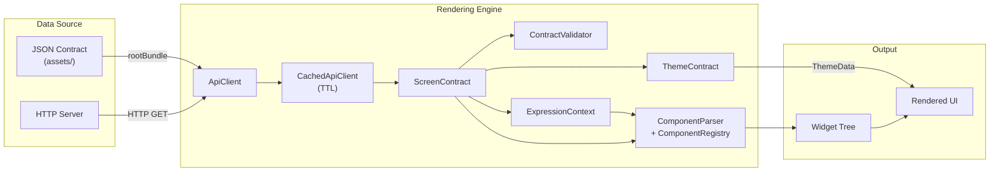
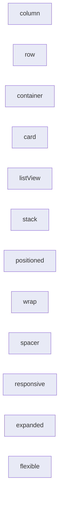
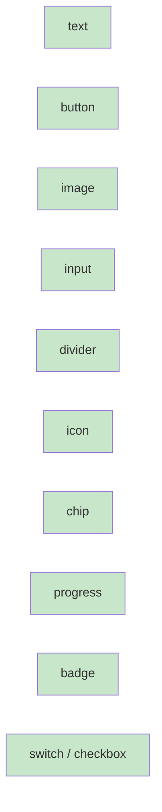
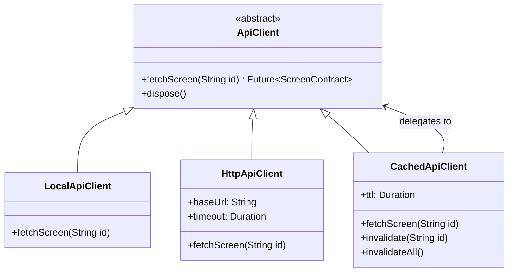

# Architecture & Schema Specification

## Overview

This project implements a **Server-Driven UI** (also known as Backend-Driven Content) pattern entirely in Flutter/Dart. The app is a generic rendering engine that interprets JSON screen contracts and builds Flutter widget trees at runtime. No screens are hardcoded.

### Design Principles

- **No hardcoded screens.** Every screen is a JSON contract loaded at runtime.
- **Recursive component tree.** A screen is a tree of nodes. Layout nodes contain children; leaf nodes render directly.
- **Actions over callbacks.** Interactive behaviour is declared in the JSON — the engine interprets them.
- **Schema versioning.** Every contract includes `schemaVersion` so the engine can handle breaking changes.
- **Extensible registry.** Adding a new component type requires one builder function and one `register()` call.
- **Pluggable data source.** The `ApiClient` abstraction lets you swap local assets for a remote API.
- **Expression engine.** Template strings (`{{var}}`) are interpolated at render time.
- **Dynamic theming.** Per-screen colors and typography are applied from the JSON contract.

---

## Data Flow



### Step-by-step

1. The app navigates to `/screen/{id}`.
2. `DynamicScreenPage` asks the `ApiClient` to fetch the screen contract.
3. `CachedApiClient` checks its in-memory cache (with TTL); on miss, delegates to the underlying client.
4. The JSON is deserialized into a `ScreenContract` model.
5. `ContractValidator` checks for schema issues and emits warnings.
6. `ExpressionContext` is built from the contract's `context` field.
7. `ThemeContract` (if present) creates a layered `ThemeData`.
8. `ComponentParser` recursively walks the component tree, interpolating templates and evaluating visibility, and builds Flutter widgets.
9. The widget tree is rendered inside a themed `Scaffold`.

---

## Screen Contract Schema

### Top-level Envelope

| Field | Type | Required | Description |
|-------|------|----------|-------------|
| `schemaVersion` | `string` | Yes | Contract format version (currently `"1.0"`) |
| `screen` | `Screen` | Yes | The screen definition |
| `context` | `object` | No | Variable bindings for expression interpolation |
| `theme` | `ThemeContract` | No | Per-screen theme overrides |

### Screen

| Field | Type | Required | Description |
|-------|------|----------|-------------|
| `id` | `string` | Yes | Unique screen identifier |
| `title` | `string` | Yes | Displayed in the app bar |
| `root` | `ComponentNode` | Yes | Root of the component tree |

### ComponentNode

| Field | Type | Required | Description |
|-------|------|----------|-------------|
| `type` | `string` | Yes | Component type identifier |
| `id` | `string` | No | Unique ID (used for input fields, switches, checkboxes) |
| `props` | `object` | No | Type-specific properties (supports `{{var}}` interpolation) |
| `children` | `ComponentNode[]` | No | Child nodes (for layout types) |
| `action` | `ActionDef` | No | Behaviour on interaction |
| `visible` | `bool \| string` | No | Conditional visibility (`true`/`false` or `"{{expr}}"`) |

### ActionDef

| Field | Type | Required | Description |
|-------|------|----------|-------------|
| `type` | `string` | Yes | Action type (see below) |
| `targetScreenId` | `string` | For `navigate`, `showDialog` | Screen ID or dialog title |
| `message` | `string` | For `snackbar`, `copyToClipboard`, `openUrl`, `showDialog` | Content |

### ThemeContract

| Field | Type | Description |
|-------|------|-------------|
| `primaryColor` | `string` | Hex color for primary |
| `secondaryColor` | `string` | Hex color for secondary |
| `backgroundColor` | `string` | Scaffold background |
| `surfaceColor` | `string` | Card/surface color |
| `errorColor` | `string` | Error color |
| `fontFamily` | `string` | Font family name |
| `defaultFontSize` | `number` | Base font size delta |
| `brightness` | `string` | `"light"` or `"dark"` |

---

## Component Types (103 total)

### Core Layout Components (12)

These components contain `children` and control layout.



#### `column` / `row`

| Prop | Type | Default | Description |
|------|------|---------|-------------|
| `mainAxisAlignment` | `string` | `"start"` | `start`, `center`, `end`, `spaceBetween`, `spaceAround`, `spaceEvenly` |
| `crossAxisAlignment` | `string` | `"start"` | `start`, `center`, `end`, `stretch` |
| `padding` | `EdgeInsets` | none | Padding around the layout |

#### `container`

| Prop | Type | Default | Description |
|------|------|---------|-------------|
| `padding` | `EdgeInsets \| number` | none | Inner padding |
| `backgroundColor` | `string` | none | Hex color |

#### `card`

| Prop | Type | Default | Description |
|------|------|---------|-------------|
| `padding` | `EdgeInsets` | none | Inner padding |
| `elevation` | `number` | `1` | Shadow elevation |

#### `listView`

| Prop | Type | Default | Description |
|------|------|---------|-------------|
| `padding` | `EdgeInsets` | none | List padding |

#### `stack`

| Prop | Type | Default | Description |
|------|------|---------|-------------|
| `alignment` | `string` | `"topStart"` | `topLeft`, `topCenter`, `center`, `bottomRight`, etc. |
| `fit` | `string` | `"loose"` | `"loose"` or `"expand"` |

#### `positioned`

| Prop | Type | Description |
|------|------|-------------|
| `top` | `number` | Distance from top |
| `bottom` | `number` | Distance from bottom |
| `left` | `number` | Distance from left |
| `right` | `number` | Distance from right |

#### `wrap`

| Prop | Type | Default | Description |
|------|------|---------|-------------|
| `spacing` | `number` | `8` | Horizontal spacing |
| `runSpacing` | `number` | `8` | Vertical spacing between runs |
| `alignment` | `string` | `"start"` | `start`, `center`, `end`, `spaceBetween`, `spaceAround`, `spaceEvenly` |
| `padding` | `EdgeInsets` | none | Padding |

#### `spacer`

| Prop | Type | Default | Description |
|------|------|---------|-------------|
| `height` | `number` | `16` | Vertical space |
| `width` | `number` | none | Horizontal space |

### Layout Wrappers (22)

Single-child wrappers that adjust positioning, sizing, and clipping.

`center` · `align` · `padding` · `sizedBox` · `constrainedBox` · `fittedBox` · `fractionallySizedBox` · `intrinsicHeight` · `intrinsicWidth` · `limitedBox` · `overflowBox` · `aspectRatio` · `baseline` · `opacity` · `clipRRect` · `clipOval` · `safeArea` · `rotatedBox` · `ignorePointer` · `absorbPointer` · `offstage` · `visibility`

### Decorators (7)

Visual decoration and transformation wrappers.

`material` · `hero` · `decoratedBox` · `indexedStack` · `transform` · `backdropFilter` · `banner`

### Scrollables (6)

Scrollable containers and sliver-based layouts.

`scrollView` · `gridView` · `pageView` · `customScrollView` · `sliverList` · `sliverGrid`

### Interactives (6)

Gesture and interaction wrappers.

`inkWell` · `gestureDetector` · `tooltip` · `dismissible` · `draggable` · `longPressDraggable`

### Animated Widgets (9)

Implicit animation wrappers driven by prop changes.

`animatedContainer` · `animatedOpacity` · `animatedCrossFade` · `animatedSwitcher` · `animatedAlign` · `animatedPadding` · `animatedPositioned` · `animatedSize` · `animatedScale`

### Tiles (5)

Structured list item components.

`listTile` · `expansionTile` · `switchListTile` · `checkboxListTile` · `radioListTile`

### Tables (4)

Tabular data layout components.

`table` · `tableRow` · `tableCell` · `dataTable`

### Text Variants (3)

Advanced text rendering beyond the basic `text` component.

`selectableText` · `richText` · `defaultTextStyle`

### Button Variants (5)

Additional button styles beyond the core `button`.

`textButton` · `outlinedButton` · `iconButton` · `floatingActionButton` · `segmentedButton`

### Miscellaneous (7)

Utility and display widgets.

`placeholder` · `circleAvatar` · `verticalDivider` · `popupMenuButton` · `searchBar` · `searchAnchor` · `tooltip`

### Leaf Components (10)



### Interactive Inputs (3)

Input components with state management.

`slider` · `rangeSlider` · `radio`

#### `text`

| Prop | Type | Description |
|------|------|-------------|
| `content` | `string` | Text to display (supports `{{var}}`) |
| `style.fontSize` | `number` | Font size |
| `style.fontWeight` | `string` | `normal`, `bold`, or `w100`–`w900` |
| `style.color` | `string` | Hex color |
| `style.textAlign` | `string` | `left`, `center`, `right` |

#### `button`

| Prop | Type | Description |
|------|------|-------------|
| `label` | `string` | Button text |
| `style.backgroundColor` | `string` | Hex background |
| `style.textColor` | `string` | Hex text color |
| `style.borderRadius` | `number` | Corner radius (default: 8) |

#### `image`

| Prop | Type | Description |
|------|------|-------------|
| `url` | `string` | Image URL |
| `width` | `number` | Width in logical pixels |
| `height` | `number` | Height in logical pixels |
| `fit` | `string` | `cover`, `contain`, `fill`, `fitWidth`, `fitHeight`, `none` |
| `borderRadius` | `number` | Corner radius |

#### `input`

| Prop | Type | Description |
|------|------|-------------|
| `label` | `string` | Field label |
| `hint` | `string` | Placeholder text |
| `maxLines` | `number` | Number of lines (default: 1) |
| `keyboardType` | `string` | `text`, `emailAddress`, `number`, `phone`, `url`, `multiline` |

#### `divider`

| Prop | Type | Default | Description |
|------|------|---------|-------------|
| `height` | `number` | auto | Total height including space |
| `thickness` | `number` | `1` | Line thickness |
| `color` | `string` | theme | Hex color |
| `indent` | `number` | `0` | Left indent |
| `endIndent` | `number` | `0` | Right indent |

#### `icon`

| Prop | Type | Default | Description |
|------|------|---------|-------------|
| `name` | `string` | `"help_outline"` | Material icon name (100+ mapped) |
| `size` | `number` | `24` | Icon size |
| `color` | `string` | theme | Hex color |

#### `chip`

| Prop | Type | Description |
|------|------|-------------|
| `label` | `string` | Chip label |
| `avatar` | `string` | Single character avatar |
| `backgroundColor` | `string` | Hex background |
| `textColor` | `string` | Hex text color |
| `outlined` | `bool` | Use OutlinedButton style |

#### `progress`

| Prop | Type | Default | Description |
|------|------|---------|-------------|
| `variant` | `string` | `"linear"` | `"linear"` or `"circular"` |
| `value` | `number` | indeterminate | 0.0–1.0 for determinate |
| `color` | `string` | theme | Indicator color |
| `trackColor` | `string` | theme | Track color |
| `strokeWidth` | `number` | `4` | Line/stroke width |
| `size` | `number` | auto | Circular indicator size |

#### `badge`

| Prop | Type | Description |
|------|------|-------------|
| `label` | `string` | Badge text |
| `backgroundColor` | `string` | Hex background |
| `textColor` | `string` | Hex text color |
| `small` | `bool` | Dot badge (no label) |

Wraps its first child with a Material `Badge`.

#### `switch` / `checkbox`

| Prop | Type | Description |
|------|------|-------------|
| `label` | `string` | Title text |
| `subtitle` | `string` | Optional subtitle |
| `value` | `bool` | Initial state |

Requires `id` for input collection.

### EdgeInsets Object

| Field | Type | Default |
|-------|------|---------|
| `top` | `number` | `0` |
| `bottom` | `number` | `0` |
| `left` | `number` | `0` |
| `right` | `number` | `0` |

A single `number` can also be used for uniform padding.

---

## Action Types (7)

### `navigate`

Pushes a new `DynamicScreenPage` onto the navigation stack.

```json
{ "type": "navigate", "targetScreenId": "profile" }
```

### `goBack`

Pops the current screen if the navigation stack allows it.

```json
{ "type": "goBack" }
```

### `snackbar`

Shows a snackbar with the given message.

```json
{ "type": "snackbar", "message": "Hello!" }
```

### `submit`

Collects all input field values on the current screen (keyed by component `id`).

```json
{ "type": "submit" }
```

### `copyToClipboard`

Copies the message to the system clipboard.

```json
{ "type": "copyToClipboard", "message": "Copy this text" }
```

### `openUrl`

Opens the URL in the device's default browser via `url_launcher`.

```json
{ "type": "openUrl", "message": "https://flutter.dev" }
```

### `showDialog`

Shows an alert dialog with a title and message.

```json
{ "type": "showDialog", "targetScreenId": "Alert Title", "message": "Dialog body" }
```

---

## Expression Engine

### Template Interpolation

Any string value in `props` containing `{{expression}}` is interpolated at render time using the `ExpressionContext` built from the contract's `context` field.

```json
{
  "context": { "user": { "name": "Ryanditko" } },
  "screen": {
    "root": {
      "type": "text",
      "props": { "content": "Hello, {{user.name}}!" }
    }
  }
}
```

Supports dot-path access (`user.name`, `settings.theme.color`). Unresolved expressions are left as-is.

### Conditional Visibility

The `visible` field on any `ComponentNode` controls whether the node is rendered:

| Value | Behavior |
|-------|----------|
| `true` / omitted | Always visible |
| `false` | Hidden |
| `"{{expr}}"` | Visible if expression resolves to truthy |

Truthy: non-null, non-false, non-zero, non-empty string.

---

## Dynamic Theming

The `theme` field in the contract allows per-screen customization:

```json
{
  "theme": {
    "brightness": "dark",
    "primaryColor": "#820AD1",
    "backgroundColor": "#1A1A2E",
    "surfaceColor": "#16213E"
  }
}
```

`ThemeContract.applyTo(ThemeData base)` layers the contract values on top of the app's base theme, producing a new `ThemeData` that wraps the `Scaffold`.

---

## Form Validation

Input fields support declarative validation rules via `props.validation`:

```json
{
  "type": "input",
  "id": "email",
  "props": {
    "label": "Email",
    "validation": {
      "required": true,
      "minLength": 5,
      "maxLength": 100,
      "pattern": "^[\\w-\\.]+@([\\w-]+\\.)+[\\w-]{2,4}$",
      "message": "Please enter a valid email"
    }
  }
}
```

| Rule | Type | Description |
|------|------|-------------|
| `required` | `bool` | Field must not be empty |
| `minLength` | `number` | Minimum character count |
| `maxLength` | `number` | Maximum character count (also sets counter) |
| `pattern` | `string` | Regex pattern to match |
| `message` | `string` | Custom error message for all rules |

Validation triggers on blur (first interaction) and then on every keystroke.

---

## Entrance Animations

Any component can declare an entrance animation via `props.animation`:

```json
{
  "type": "text",
  "props": {
    "content": "Hello",
    "animation": { "type": "fadeIn", "duration": 500, "delay": 200 }
  }
}
```

| Animation Type | Description |
|---------------|-------------|
| `fadeIn` | Opacity from 0 to 1 |
| `slideUp` | Slide from below + fade |
| `slideLeft` | Slide from right + fade |
| `scale` | Scale from 0.85 to 1 + fade |

| Prop | Type | Default | Description |
|------|------|---------|-------------|
| `type` | `string` | `"fadeIn"` | Animation type |
| `duration` | `number` | `400` | Duration in milliseconds |
| `delay` | `number` | `0` | Delay before starting in milliseconds |

---

## Error Boundary

Every component is wrapped in an `ErrorBoundary` widget that catches build-time exceptions and renders a graceful fallback instead of crashing the entire screen. The fallback shows the component type and error message in a red container.

---

## Accessibility

All interactive and leaf components include `Semantics` widgets for screen reader support:

- `text` — labeled with content
- `button` — marked as button with label
- `image` — marked as image with semantic label
- `icon` — labeled with icon name
- `input` — marked as text field with label
- `switch` — marked as toggled with label
- `checkbox` — marked as checked with label
- `textButton` / `outlinedButton` — marked as button with label
- `inkWell` / `gestureDetector` — marked as button when action is present
- `selectableText` — labeled with content
- `richText` — labeled with concatenated span text
- `placeholder` — labeled as "Placeholder"
- `circleAvatar` — labeled with text or "Avatar"

---

## Contract Validation

`ContractValidator.validate(ScreenContract)` returns a list of warnings:

- Unsupported schema version
- Empty screen id or title
- Unknown component types
- Leaf components with children
- Missing required props (`content` for text, `label` for button, `url` for image)
- Input without `id`
- Unknown action types
- Navigate without `targetScreenId`

---

## Network Layer



- **LocalApiClient** — loads JSON from `assets/screens/` via `rootBundle`
- **HttpApiClient** — fetches contracts from an HTTP server with timeout
- **CachedApiClient** — wraps any `ApiClient`, caching responses in-memory with configurable TTL

### Mock Backend Server

A standalone Dart Shelf server lives in `server/` and serves the same JSON contracts via REST:

| Endpoint | Description |
|----------|-------------|
| `GET /api/screens` | List all available screen IDs |
| `GET /api/screens/:id` | Fetch a screen contract by ID |
| `GET /health` | Health check |

Start with `cd server && dart run bin/server.dart`. Connect from the Flutter app using `HttpApiClient(baseUrl: 'http://localhost:8080/api/screens')`.

---

## Playground

The playground provides a development tool for editing and previewing JSON contracts:

- **JSON Editor** — monospace text field with dark theme
- **Live Preview** — renders the contract using the same `ComponentParser`
- **Screen Selector** — dropdown to load existing asset screens
- **Auto-render** — debounced parsing on every keystroke
- **Validation** — inline warnings from `ContractValidator`
- **Format/Clear** — toolbar actions for JSON formatting and clearing

---

## Adding a New Screen

1. Create `assets/screens/your_screen.json` following the schema
2. Reference it from any button: `{ "type": "navigate", "targetScreenId": "your_screen" }`

No Dart code changes needed.

## Adding a New Component

1. Create a builder function in `lib/presentation/widgets/`:

```dart
Widget buildYourComponent(
  ComponentNode node,
  BuildContext context,
  Widget Function(ComponentNode) buildChild,
) {
  // Build and return your widget
}
```

2. Register it in `ComponentParser._registerDefaults()`:

```dart
_registry.register('yourType', buildYourComponent);
```
